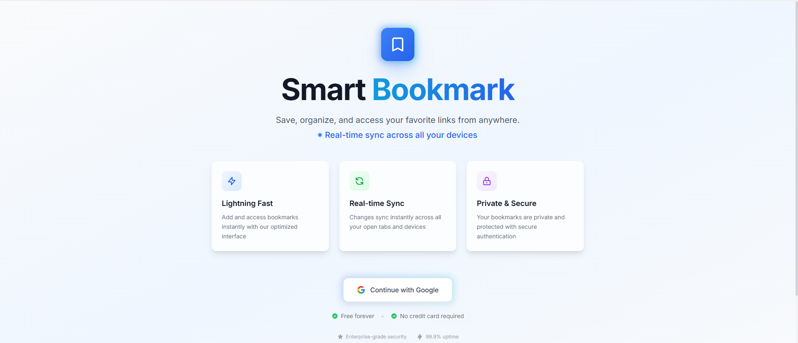
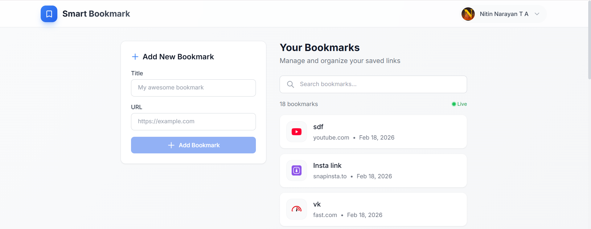

# 🔖 Smart Bookmark Manager

A modern, real-time bookmark management application built with Next.js, Supabase, and Tailwind CSS. Users can sign in with Google, save bookmarks, and see changes sync instantly across multiple tabs.

## 🔗 Live Demo

**[View Live Application](https://smart-bookmark-app-orcin-chi.vercel.app)**

---

## ✨ Features

- **Google OAuth Authentication** — Secure sign-in using Google accounts
- **Add & Delete Bookmarks** — Save URLs with titles, remove with confirmation
- **Real-time Sync** — Changes appear instantly across all open tabs using Supabase Realtime
- **Private Bookmarks** — Each user can only see their own bookmarks (Row Level Security)
- **Search** — Filter bookmarks by title or URL
- **Responsive Design** — Works on desktop, tablet, and mobile
- **Animated Landing Page** — Smooth entrance animations and hover effects

---

## 🛠️ Tech Stack

| Technology | Purpose |
|------------|---------|
| **Next.js 15** (App Router) | Frontend framework with server-side rendering |
| **Supabase** | Database (PostgreSQL), Authentication, and Realtime |
| **Tailwind CSS** | Utility-first CSS styling |
| **TypeScript** | Type-safe development |
| **Vercel** | Deployment and hosting |

---

## 📸 Screenshots

### Landing Page



- Clean, animated landing page with Google OAuth sign-in
- Feature cards with hover effects
- Gradient text animations and floating blob background

### Dashboard



- Two-column layout: Add bookmark form + bookmark list
- Real-time status indicator (Live/Connecting/Disconnected)
- Search functionality with instant filtering
- Favicon display for each bookmarked site
- Delete confirmation dialog

---

## 🧩 Problems I Faced & How I Solved Them

### 1. Next.js 15 Breaking Changes with `cookies()`

**Problem:** When I created the Supabase server client, I got TypeScript errors:
Property 'get' does not exist on type 'Promise<ReadonlyRequestCookies>'

text


**Root Cause:** Next.js 15 changed `cookies()` from a synchronous function to an **asynchronous** function that returns a Promise.

**Solution:** I updated the server client to use `async/await`:
```typescript
// Before (Next.js 14)
const cookieStore = cookies()

// After (Next.js 15)
const cookieStore = await cookies()
I also had to add await wherever createClient() was called in server components and route handlers.

2. Tailwind CSS v4 Compatibility Issues
Problem: The project initialized with Tailwind CSS v4, which uses completely different syntax. The @tailwind base directive threw errors:

text

'@tailwind base' is no longer available in v4
Root Cause: Tailwind v4 replaced the @tailwind directives with @import "tailwindcss" and removed support for @apply with custom CSS variables.

Solution: I downgraded to Tailwind CSS v3 (stable version) for better compatibility and documentation support:

Bash

npm uninstall tailwindcss @tailwindcss/postcss
npm install -D tailwindcss@^3.4.1 postcss autoprefixer
npx tailwindcss init -p
3. Supabase TypeScript Types Not Working
Problem: When inserting bookmarks, TypeScript showed:

text

Argument of type '{user_id: string, title: string, url: string}'
is not assignable to parameter of type 'never'
Root Cause: The Supabase client wasn't properly inferring the database types from the Database interface, likely due to a version mismatch between @supabase/ssr and the type definitions.

Solution: I used type assertions (as any) for the insert operation and manually defined the database types in types/database.ts. For a production app, I would use supabase gen types to auto-generate types from the database schema.

4. Real-time Updates Not Working
Problem: When adding or deleting bookmarks, the UI only updated after a manual page refresh. The Supabase Realtime subscription wasn't receiving events.

Root Cause: Three issues combined:

The bookmarks table wasn't added to the supabase_realtime publication
REPLICA IDENTITY wasn't set to FULL, so DELETE events didn't include row data
The component architecture didn't support shared state between the form and list
Solution:

Database fix:

SQL

ALTER PUBLICATION supabase_realtime ADD TABLE bookmarks;
ALTER TABLE bookmarks REPLICA IDENTITY FULL;
Architecture fix: I created a DashboardContent client component that manages shared state between AddBookmarkForm and BookmarkList. The form calls an onAdd callback after inserting, and the list calls onDelete before sending the delete request to the database. This gives instant UI updates while Realtime handles cross-tab synchronization.

text

Same Tab:  Form → onAdd() → State Update → UI Update (instant)
Cross Tab: DB Change → Supabase Realtime → onAdd()/onDelete() → UI Update
5. Delete Button Freezing
Problem: When clicking delete, the button showed "Deleting..." and froze. The bookmark only disappeared after refreshing the page.

Root Cause: The component was waiting for the Realtime DELETE event to remove the bookmark from the UI, but the Realtime subscription wasn't working (see Problem 4).

Solution: I implemented optimistic UI updates — the bookmark is removed from the UI state immediately when the user clicks delete, and the database deletion happens in the background:

TypeScript

const handleDelete = async () => {
  // Step 1: Remove from UI IMMEDIATELY
  onDelete(bookmark.id)

  // Step 2: Delete from database in background
  await supabase.from('bookmarks').delete().eq('id', bookmark.id)
}
6. PowerShell Script Execution Policy
Problem: Running npm run dev in PowerShell threw:

text

File cannot be loaded because running scripts is disabled on this system
Root Cause: Windows PowerShell's default execution policy blocks script execution for security.

Solution: Changed the execution policy for the current user:

PowerShell

Set-ExecutionPolicy -ExecutionPolicy RemoteSigned -Scope CurrentUser
Alternatively, I used Command Prompt (cmd) instead of PowerShell, which doesn't have this restriction.

7. Google OAuth Redirect URI Mismatch
Problem: After clicking "Continue with Google," the authentication failed with a redirect URI error.

Root Cause: The callback URL in Google Cloud Console didn't exactly match the Supabase callback URL. Even a trailing slash or wrong protocol causes a mismatch.

Solution: I copied the exact callback URL from Supabase Dashboard (Authentication → Providers → Google) and pasted it into Google Cloud Console's authorized redirect URIs:

text

https://[PROJECT_REF].supabase.co/auth/v1/callback
8. Search Icon Overlapping Input Text
Problem: The search magnifier icon and placeholder text were merging together in the search input.

Root Cause: The SVG icon was positioned with absolute but the input's padding-left wasn't large enough to accommodate it.

Solution: I wrapped the icon in a properly positioned container and increased the input's left padding:

React

<div className="absolute inset-y-0 left-0 flex items-center pl-4 pointer-events-none">
  <svg>...</svg>
</div>
<input style={{ paddingLeft: '3rem' }} />
🚀 Getting Started
Prerequisites
Node.js 18+ installed
A Supabase account
A Google Cloud Console account (for OAuth)
1. Clone the Repository
Bash

git clone https://github.com/YOUR_USERNAME/smart-bookmark-app.git
cd smart-bookmark-app
2. Install Dependencies
Bash

npm install
3. Set Up Supabase
Create a new project at supabase.com
Run the SQL schema in the SQL Editor:
SQL

CREATE TABLE bookmarks (
    id UUID DEFAULT gen_random_uuid() PRIMARY KEY,
    user_id UUID REFERENCES auth.users(id) ON DELETE CASCADE NOT NULL,
    title TEXT NOT NULL,
    url TEXT NOT NULL,
    created_at TIMESTAMPTZ DEFAULT NOW() NOT NULL,
    updated_at TIMESTAMPTZ DEFAULT NOW() NOT NULL
);

ALTER TABLE bookmarks ENABLE ROW LEVEL SECURITY;

CREATE POLICY "Users can view own bookmarks" ON bookmarks
    FOR SELECT USING (auth.uid() = user_id);

CREATE POLICY "Users can insert own bookmarks" ON bookmarks
    FOR INSERT WITH CHECK (auth.uid() = user_id);

CREATE POLICY "Users can delete own bookmarks" ON bookmarks
    FOR DELETE USING (auth.uid() = user_id);

ALTER PUBLICATION supabase_realtime ADD TABLE bookmarks;
ALTER TABLE bookmarks REPLICA IDENTITY FULL;
Enable Google OAuth in Authentication → Providers
4. Set Up Environment Variables
Create a .env.local file:

env

NEXT_PUBLIC_SUPABASE_URL=your_supabase_url
NEXT_PUBLIC_SUPABASE_ANON_KEY=your_supabase_anon_key
NEXT_PUBLIC_SITE_URL=http://localhost:3000
5. Run Development Server
Bash

npm run dev
Open http://localhost:3000

📁 Project Structure
text

smart-bookmark-app/
├── app/
│   ├── auth/callback/route.ts    # OAuth callback handler
│   ├── dashboard/page.tsx        # Dashboard (server component)
│   ├── globals.css               # Global styles
│   ├── layout.tsx                # Root layout
│   └── page.tsx                  # Landing page
├── components/
│   ├── AddBookmarkForm.tsx       # Form to add bookmarks
│   ├── AuthButton.tsx            # Google sign-in button
│   ├── BookmarkItem.tsx          # Individual bookmark card
│   ├── BookmarkList.tsx          # List with realtime subscription
│   ├── DashboardContent.tsx      # Shared state manager
│   └── Navbar.tsx                # Navigation bar
├── lib/supabase/
│   ├── client.ts                 # Browser Supabase client
│   ├── middleware.ts             # Auth middleware helper
│   └── server.ts                 # Server Supabase client
├── types/
│   └── database.ts               # TypeScript type definitions
├── middleware.ts                  # Route protection
└── .env.local                    # Environment variables
🔐 Security
Row Level Security (RLS): Users can only access their own bookmarks
Server-side Auth: User sessions are validated on the server before rendering
Protected Routes: Middleware redirects unauthenticated users to the login page
OAuth Only: No password storage — authentication is handled entirely by Google
📦 Deployment
The app is deployed on Vercel with automatic deployments on git push:

Bash

git add .
git commit -m "your message"
git push
Vercel automatically builds and deploys the latest code.

📄 License
This project is open source and available under the MIT License.